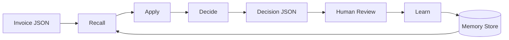

# Invoice Memory System

> A memory-driven learning layer for invoice automation that learns from human corrections, detects duplicates, and improves over time.

---

## 🚀 Overview

The **Invoice Memory System** is a TypeScript-based engine designed to sit between an invoice extraction service (like OCR) and your ERP/Accounting system. It solves the problem of repetitive manual corrections by "remembering" how users fix data and automatically applying those patterns to future invoices.

**Key Features:**
- **🧠 Continuous Learning**: Maps vendor-specific fields (e.g., "Leistungsdatum" → `serviceDate`) based on human feedback.
- **🛡️ Bad Memory Protection**: Prevents one-off errors from teaching the system incorrect rules using a confidence scoring system.
- **🔍 Duplicate Detection**: Identifies potential duplicate invoices using fuzzy hashing (Vendor + Invoice # + Date/Amount).
- **📝 Audit Trail**: Provides a complete, transparent log of why a decision was made (Recall → Apply → Decide).

---

## 🏗️ Architecture

The system follows a linear pipeline architecture with a persistent feedback loop:



### Core Components

1.  **Memory Store**: A JSON-based persistence layer (migratable to SQL) that stores:
    -   **Vendor Memory**: Rules specific to a supplier (VAT behaviors, currency).
    -   **Correction Memory**: Learned field mappings and regex patterns.
    -   **Duplicate Records**: Hashes of previously seen invoices.

2.  **Pipeline Stages**:
    -   **Recall**: Fetch relevant memories for the incoming invoice's vendor.
    -   **Apply**: Execute learned rules to propose corrections (e.g., "Change currency to EUR").
    -   **Decide**: Calculate a final **Confidence Score**. If < 0.85, flag for `requiresHumanReview`.
    -   **Learn**: After human verification, update confidence scores (Reinforce or Penalize).

---

## 🛠️ Installation & Setup

**Prerequisites:**
-   Node.js >= 18.0.0
-   npm

**Setup:**

```bash
# 1. Install dependencies
npm install

# 2. Build the project
npm run build
```

**Running Tests:**

```bash
# Run the smoke test (quick validation)
npm run smoke
```

---

## 🎮 Demo Walkthrough

We have included a comprehensive demo script that simulates a real-world learning lifecycle.

**Run the Demo:**

```bash
npm run demo
```

**What Happens in the Demo?**

1.  **Scenario 1: Supplier GmbH (Field Mapping)**
    -   The system sees an invoice with a missing `serviceDate`.
    -   It flags it for review (`Confidence: 62%`).
    -   **Human Action**: User maps `Leistungsdatum` from raw text to `serviceDate`.
    -   **System Learns**: The system records this pattern.
    -   **Next Invoice**: The system **automatically applies** the mapping (`Confidence: 78%`).

2.  **Scenario 2: Parts AG (VAT Correction)**
    -   System detects a vendor with consistent VAT calculation issues.
    -   It learns to recalculate totals based on historical corrections.

3.  **Scenario 3: Duplicate Detection**
    -   System flags a re-submitted invoice as a **Duplicate** preventing double-payment.

---

## 📐 Design Decisions

### Confidence Scoring
Every memory starts with a base confidence (`0.3`).
-   **Reinforcement**: +0.15 when a prediction is accepted.
-   **Penalty**: -0.20 when a prediction is rejected.
-   **Auto-Apply Threshold**: **0.85** (High confidence required to bypass human review).
-   **Hard Rejection**: Repeatedly rejected rules are effectively disabled (`< 0.1`).

### Bad Memory Protection
To prevent poisoning the system with bad data:
-   **Skip Learning on Duplicates**: Duplicate invoices do not reinforce rules.
-   **Contradiction Checks**: If a rule conflicts with existing high-confidence rules, it is flagged.

---

## 🔍 Audit & Explainability

Transparency is critical for automation. The system generates an `auditTrail` array in the output:

```json
"auditTrail": [
  { "step": "recall", "details": "Found vendor memory for 'Parts AG' (Conf: 0.9)" },
  { "step": "apply", "details": "Applied partial correction for 'currency' -> 'EUR'" },
  { "step": "decide", "details": "Confidence 0.65 below threshold 0.85. Requesting review." }
]
```

This allows developers and support teams to trace exactly **why** a field was changed or why a document was flagged.

---

## 🔌 Extensibility

The system is designed for growth:

-   **Database Migration**: The `MemoryStore` class encapsulates all file I/O. Replace `loadFromDisk` and `saveToDisk` with SQL queries to switch to PostgreSQL/SQLite.
-   **New Rules**: Add logic to `src/core/rules/` (e.g., `lineItemRules.ts`) and register them in the `pipeline.ts`.
-   **API Integration**: Wrap the `processInvoice` function in a REST controller (Express/Fastify) to serve as a microservice.

---

## License

MIT
