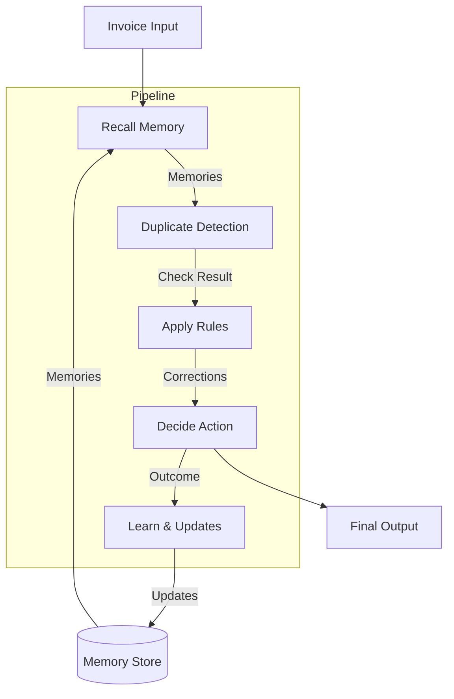

# Invoice Memory System - Architecture

This document describes the high-level architecture of the Invoice Memory System.

---

## Overview

The Invoice Memory System is a memory-driven learning layer for invoice automation. It receives pre-extracted invoice data and uses persistent memory to learn vendor-specific patterns and apply corrections.

```
┌─────────────────────────────────────────────────────────────────┐
│                        Invoice Input                             │
│                   (Pre-extracted JSON data)                      │
└─────────────────────────────────────────────────────────────────┘
                              │
                              ▼
┌─────────────────────────────────────────────────────────────────┐
│                      Decision Engine                             │
│  ┌──────────┐  ┌──────────┐  ┌──────────┐  ┌──────────┐        │
│  │  Recall  │─▶│  Apply   │─▶│  Decide  │─▶│  Learn   │        │
│  └──────────┘  └──────────┘  └──────────┘  └──────────┘        │
└─────────────────────────────────────────────────────────────────┘
                              │
              ┌───────────────┼───────────────┐
              ▼               ▼               ▼
┌─────────────────┐  ┌─────────────────┐  ┌─────────────────┐
│  Memory Store   │  │  Audit Trail    │  │  Decision Output│
│  (Persistent)   │  │  (JSONL Log)    │  │  (JSON Response)│
└─────────────────┘  └─────────────────┘  └─────────────────┘
```

---

## Core Components

### 1. Decision Engine (`src/core/decision-engine.ts`)

The central processing unit that orchestrates invoice processing through four stages:

| Stage | Purpose |
|-------|---------|
| **Recall** | Retrieve relevant memories (vendor patterns, corrections, duplicates) |
| **Apply** | Generate proposed corrections based on recalled memories |
| **Decide** | Determine confidence score and whether human review is needed |
| **Learn** | Generate memory updates for persistence |

### 2. Memory Manager (`src/memory/memory-manager.ts`)

Handles persistence and retrieval of four memory types:

- **Vendor Memory**: Canonical names, name variations, typical patterns
- **Correction Memory**: Field-level corrections with confidence
- **Resolution Memory**: How ambiguities were previously resolved
- **Duplicate Records**: Invoice hashes for duplicate detection

### 3. Types (`src/types/index.ts`)

Comprehensive TypeScript interfaces ensuring type safety across:

- Invoice input/output structures
- Memory record schemas
- Configuration options
- Audit trail entries

### 4. Demo System (`src/demo/demoRunner.ts`)
Demonstrates the learning loop by:
1.  Loading sample invoices and corrections.
2.  Processing an invoice (Learning Phase).
3.  Simulating user feedback.
4.  Reprocessing subsequent invoices to verify learning (Application Phase).

---

## End-to-End Flow

The following sequence describes the "Human-in-the-loop" learning process:

1.  **Ingestion**: `processInvoice` receives raw JSON.
2.  **Recall**: System checks for known vendor rules and past corrections.
3.  **Prediction**: System applies existing knowledge (e.g., "Map 'Leistungsdatum' to 'serviceDate'").
4.  **Decision**:
    -   High Confidence? -> **Auto-Apply**
    -   Low Confidence or Exceptions? -> **Flag for Review**
5.  **Human Review** (Simulated in Demo):
    -   User confirms or corrects data.
    -   Corrections are fed back into the system.
6.  **Learning**:
    -   System updates `MemoryStore` with new patterns.
    -   Confidence for verified predictions increases.
7.  **Next Run**: Subsequent invoices benefit from updated memory.

---

## Data Flow

The invoice processing pipeline follows a linear flow with a persistent memory feedback loop:



## Memory Lifecycle

Memories evolve based on their usage and feedback:

1.  **Creation**: New memories start with `initialConfidence` (0.3).
2.  **Reinforcement**: When a correction is approved or a prediction is verified, confidence increases (`+0.15`).
3.  **Penalization**: When a suggestion is rejected, confidence decreases (`-0.20`).
4.  **Hard Rejection**: Repeated rejections cause a stronger penalty (`-0.35`).
5.  **Decay**: Inactive memories lose confidence over time to prioritize recent patterns.
6.  **Deactivation**: Memories falling below `0.1` confidence are effectively disabled.

## Configuration

System behavior is controlled by `src/config.ts`:

- **Confidence Thresholds**:
  - `AUTO_APPLY_THRESHOLD` (0.85): Corrections applied without review.
  - `HUMAN_REVIEW_THRESHOLD` (0.6): High enough to suggest, but needs review.
  - `UNRELIABLE_THRESHOLD` (0.5): Below this, memories are considered suspect.

- **Protection Settings**:
  - `SKIP_LEARNING_FOR_DUPLICATES`: Prevents bad data reinforcement.
  - `BAD_MEMORY_PROTECTION`: Limits the impact of contradictory memories.

## Audit System (`src/core/audit.ts`)

To ensure explainability, every pipeline execution generates a structured audit log:

-   **Structure**: Array of `AuditTrailEntry` objects (` { step, timestamp, details } `).
-   **Granularity**: Logs major decisions (Recall count, specific rules applied, confidence calculations).
-   **Storage**: currently embedded in the JSON response; can be streamed to Elastic/Splunk in future.

## Persistence Strategy

Currently, the system uses a file-based persistence mechanism:

- **Storage**: JSON file located at `data/memory.json`.
- **Atomic Writes**: The entire store is written to disk on save.
- **In-Memory Cache**: All memories are loaded into memory for fast access during processing.
- **Migration**: The `MemoryStore` class handles schema versioning (current: `2.0.0`) and migration logic.

Future scalability can be achieved by swapping `MemoryStore` backend to SQLite or Redis without changing the `MemoryManager` interface.
